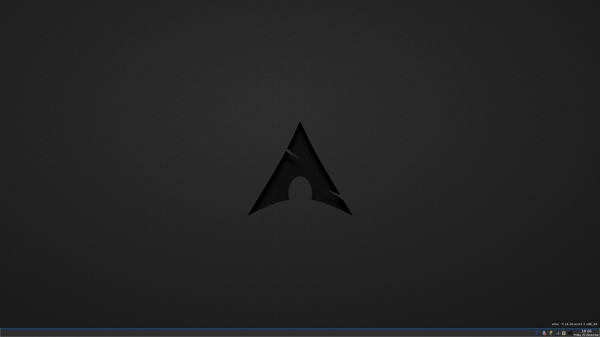

Earch Desktop
===========

A minimal xorg graphical environment for Arch Linux based on Openbox that I've been using for the past decade:

- Simple ultrafast Openbox configuration with various shortcuts to improve productivity;
- Minimalistic styled Arch Linux theme;
- Various utilities for daily usage;
- Shared here for anyone due to various requests.

When or why would you use this?
- You like a very minimal desktop environment but don't want to spend hours to configure each component.

### Screenshot



Setup dependencies
------------------

This setup assumes only a minimal Arch setup has been performed. 

### Install dependencies

```bash
sudo pacman -S alsa-lib alsa-utils bash-completion calc cbatticon conky dmenu dunst firefox firejail freetype2 geeqie git git-crypt gmrun gtk-engines keepassxc leafpad lightdm lightdm-gtk-greeter linux-firmware lxappearance network-manager-applet networkmanager nitrogen obconf openbox parcellite pass pasystray pavucontrol pcmanfm pulseaudio screen scrot signal-desktop thunderbird tint2 util-linux vim xdotool xorg-server xorg-xbacklight xorg-xrandr xorg-xrdb xscreensaver xss-lock xterm
```
> Note: if installing along an existing desktop environment, you might want to omit the lightdm packages.

### Enable daemons
```bash
sudo systemctl enable lightdm
sudo systemctl enable NetworkManager
```

Setup home skeleton
-------------------

### Configure homedir
Copy contents of lib/homeskel to either /etc/skel for a global config or your home folder for local.

`cp -r lib/homeskel/. $HOME` 

### Nitrogen
While all configs are working dynamically, Nitrogen isn't able to understand ~ as homedir. Therefore you have to manually point Nitrogen to the right directory, unless you use /home/evdh as homedir =).

Included configuration
-----------------------

- bashrc 
- screenrc 
- vimrc 
- GTK 
- conky 
- dunst
- tint2rc 
- nitrogen (requires tweaking, see note above)
- openbox
- parcellite 
- gnupg 


Available shortcuts
-------------------

Default Openbox shortcuts have been preserved, below are added or are explicitly mentioned for productivity purposes.

### Openbox Desktop management

| Shortcut       | Description      |
| -------------- | ---------------- |
| CTRL+Q         | Quit active application |


### Program shortcuts

| Shortcut       | Description      |
| -------------- | ---------------- |
| CTRL+ALT+T     | Start xterm and start or re-attach to screen. Use CTRL+ALT+{1-4} for different namespaces. |
| CTRL+ALT+U     | Start xterm. |
| CTRL+ALT+K     | Start keepassxc. |
| CTRL+ALT+S     | Start signal desktop. |
| CTRL+ALT+D     | Start passmenu (Convenient menu for passwordstore). |
| CTRL+ALT+SHIFT+D | Start passmenu in type-mode (Types the password instead of putting it in the clipboard). |
| CTRL+ALT+Y     | Start texmaker (Not installed by dependencies above). |
| CTRL+ALT+E     | Start gmrun, allowing quick application execution. |
| CTRL+ALT+W     | Start Thunderbird. |
| CTRL+ALT+F     | Start Firefox in private mode. |
| CTRL+ALT+SHIFT+F | Start Firefox in normal mode. |
| CTRL+ALT+Q     | Start Calc. |
| CTRL+ALT+C     | Start QOwnNotes (Available in AUR, vim+markdown based note utility). |
| CTRL+ALT+V     | Start leafpad. |
| CTRL+ALT+V     | Start PCman File Manager (Graphical file explorer). |
| CTRL+ALT+G     | Start Signal Desktop client. |

### System shortcuts

| Shortcut       | Description      |
| -------------- | ---------------- |
| CTRL+ALT+M     | Start Volume Control. |
| CTRL+ALT+SHIFT+M | Start Alsamixer Volume Control. |
| CTRL+ALT+R     | Run restore desktop script, reconfiguring conky, tint2 and background. |
| CTRL+ALT+P     | Runs reset screen script, useful for laptop screens to reset default output. |
| ALT+SHIFT+3    | Screenshot based on selection, automatically stored in ~/images/screenshots. |
| ALT+SHIFT+4    | Screenshot of full screen, automatically stored in ~/images/screenshots. |
| WIN+V          | Press middle mouse button (paste X selection clipboard). |
| CTRL+SHIFT+V   | Show parcellite clipboard. |
| CTRL+ALT+L     | Lock Screen. |
| CTRL+ALT+SHIFT+L | Lock Screen and suspend. |

### Tiling shortcuts

| Shortcut       | Description      |
| -------------- | ---------------- |
| Win+ArrowLeft  | Resize Window's width to 50% and align to the left. |
| Win+ArrowRight | Resize Window's width to 50% and align to the right. |
| Win+ArrowUp    | Resize Window's height to 50% and align to the top. |
| Win+ArrowDown  | Resize Window's height to 50% and align to the bottom. |
| Win+K          | Resize both Window's width and height to 100%. |

### Implemented XF86 keys

| Key                   | Action                    |
| --------------------- | ------------------------- |
| XF86MonBrightnessUp   | ~/.bin/brightnessctl up   |
| XF86MonBrightnessDown | ~/.bin/brightnessctl down |
| XF86AudioRaiseVolume  | amixer set Master 10%+    |
| XF86AudioLowerVolume  | amixer set Master 10%-    |
| XF86AudioMute         | amixer set Master toggle  |

Used packages
-------------------

| Package               | Description | 
| --------------------- | ----------- |
| alsa-lib              | Library for sound. |
| alsa-utils            | Tools to manage Alsa, primarily used for alsamixer. |
| bash-completion       | Autocomplete in bash. |
| calc                  | Command line calculator. |
| cbatticon             | Additional battery icon, useful for laptops. |
| conky                 | Utility to illustrate system metrics on the desktop, used to display hostname, kernel and architecture. |
| dmenu                 | Library to create menu's in Xorg |
| dunst                 | Desktop notification tool. |
| firefox               | The browser anyone should use primarily. |
| firejail              | Sandbox program, particulary useful to sandbox client applications such as Firefox. |
| freetype2             | Font rasterization library. |
| geeqie                | Simple image display utility. |
| git                   | The popular version control system. |
| git-crypt             | Extension for git allowing to encrypt various files. |
| gmrun                 | Simple software run application. |
| gtk-engines           | Theme engine for GTK. |
| keepassxc             | KeePass alternative. |
| leafpad               | Simple notepad utility. |
| lightdm               | Lightweight desktop manager, allowing to manage login sessions. |
| lightdm-gtk-greeter   | Lightweight greeter, providing the login prompt. |
| linux-firmware        | Required as dependency. |
| lxappearance          | Tool to manage Openbox appearance. |
| network-manager-applet| Tray applet for Network Manager. |
| networkmanager        | Network Manager, especially easy for laptops managing various WiFi and VPN connections. |
| nitrogen              | Wallpaper utility. |
| obconf                | Openbox configuration utility. |
| openbox               | The actual window manager. |
| parcellite            | Simple clipboard manager. |
| pass                  | Passwordstore.org password manager. |
| pasystray             | Pulse audio system tray icon. |
| pavucontrol           | Pulse audtio volume control. |
| pcmanfm               | Simple file manager. |
| pulseaudio            | Pulse audio, acting as audio interface on top of alsa so multiple programs can simultaneously play audio. |
| screen                | GNU Screen. |
| scrot                 | Screenshot utility. |
| signal-desktop        | Desktop client for Signal messenger. |
| thunderbird           | Mozilla's email client. |
| tint2                 | Heavily customizable taskbar. |
| util-linux            | Various utilities. |
| vim                   | You're probably looking at the wrong repo if this is new to you. |
| xdotool               | Utility enabling to perform xorg commands from the CLI. |
| xorg-server           | Xorg, X server enabling a GUI. |
| xorg-xbacklight       | Backlight utility. |
| xorg-xrandr           | Command line utility to configure display output. |
| xorg-xrdb             | Utility to merge Xorg settings with locals. |
| xscreensaver          | Lightweight screensaver. |
| xss-lock              | Simple utility that helps locking the screen. |
| xterm                 | Lightweight terminal emulator. |

Sources
-------

This configuration embeds and extends content from various other sources, see table below for references.

| Source | Description | URL |
| ------ | ---- | --- |
| Faenza-Cupertino | Embedded icon theme. | [Source](https://www.xfce-look.org/p/1012542) |
| GTK theme Elegant Brit | Source for the embedded GTK theme. | [Source](https://www.xfce-look.org/p/1080228) |
| Arch-Linux-Wallpaper.png | Used wallpaper. | [Source](https://www.wallpaperflare.com/arch-linux-dark-gray-archlinux-minimalism-no-people-copy-space-wallpaper-zfi) |

